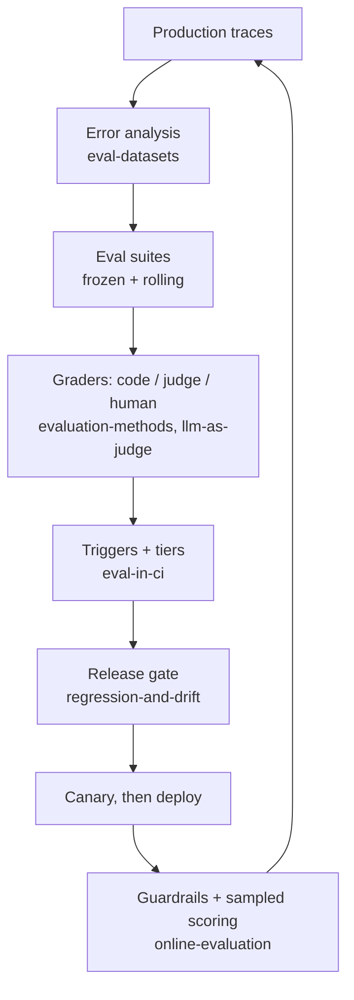

# 4. Evaluation

Knowing whether it actually works.

_Scope: eval design, datasets, human review, LLM-as-judge, multi-turn & memory, guardrail evals, online evaluation, CI triggers, regression gating._

## Notes

- [evaluation-methods.md](evaluation-methods.md) — canonical: outcome vs. trajectory grading, the three grader types, pass@k vs. pass^k, capability vs. regression sets, expert debate.
- [eval-datasets.md](eval-datasets.md) — error analysis first; where cases come from; who owns the label; annotation tooling (trace queues vs. Label Studio vs. a custom app).
- [llm-as-judge.md](llm-as-judge.md) — when to use a judge, how to design one, validating it as a classifier, known biases.
- [multi-turn-and-memory.md](multi-turn-and-memory.md) — replay vs. simulated users; session-level scoring; concrete short- and long-term memory tests.
- [guardrail-evaluation.md](guardrail-evaluation.md) — company-specific policy as a testable register; violation recall *and* over-refusal; adversarial cases including indirect injection.
- [online-evaluation.md](online-evaluation.md) — guardrail vs. online eval vs. offline eval; sampling; the free production signals; behavioural anomaly detection.
- [eval-in-ci.md](eval-in-ci.md) — what runs on which change; detecting prompt changes by rendered-artefact hash; tiering and cost control.
- [regression-and-drift.md](regression-and-drift.md) — the pre-registered release gate, paired non-inferiority comparison, model swaps, drift.

## The short version

1. Read traces before you build metrics — the failure taxonomy is the eval suite.
2. Grade end state, not the transcript; use a judge only for what code can't check.
3. One run proves nothing: k trials, and pass^k is the metric users experience.
4. Offline evals gate the deploy; production monitoring finds what the suite never contained; every production failure becomes an offline case.
