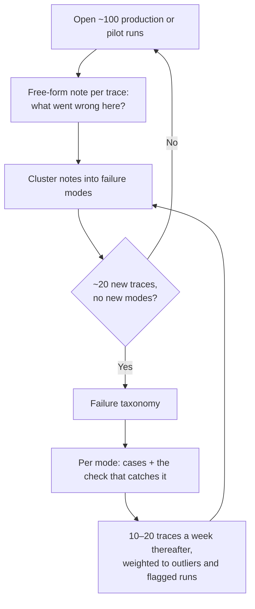

# Eval datasets & human review

The eval set is the real specification. Everything downstream — the judge, the CI gate, the release decision — is only as good as the cases in it. This note covers where cases come from, who owns the label, and what tooling the humans need.

## Error analysis before infrastructure

The first move is not to pick a platform. It is to **read traces**.



That taxonomy *is* the eval suite. Metrics invented before error analysis measure what you imagined, and the well-known outcome is a dashboard of green "helpfulness 4.2/5" scores next to users complaining. Expect this reading to absorb a large share of total eval effort — it is the work, not the preamble.

## From trace to case

A trace is **evidence, not a test**. Keeping the failed runs and replaying them is the intuitive move and the wrong one: transcripts contain the old agent's outputs, so replaying them mostly re-measures a system you no longer run.

What you extract from a failed run is the **input, the environment it ran against, and the invariant it violated**:

```yaml
id: CASE-014
mode: FM-03-quoted-stale-price     # the failure mode, not the trace
source_trace: tr_9f2c1a            # provenance for a human, not part of the test
input:
  message: "Can you confirm the renewal price for account 88213?"
fixtures:
  db: seeds/retail-2026-03.sql     # reset to a known state before each run
  clock: 2026-03-14T09:00:00Z      # so temporal behaviour is reproducible
assert:
  - state: quotes.where(account=88213).count == 1
  - absent: ["guaranteed", "locked in"]
  - judge: names_the_validity_window
reference: |                       # the expert's corrected answer
  The renewal price is €412/yr, valid until 31 March...
```

**"Define what it should have been" holds only for closed-form tasks.** Where there is genuinely one right answer — extraction, classification, routing, a SQL query you grade on its *result set* rather than its text, arithmetic — store the gold answer and compare directly. For open-ended output there is no single correct text, and pinning one turns your suite into a prose-diffing machine that fails on every harmless rewording. There you store the *violated invariant* as the assertion, and keep the expert's correction as `reference`: material for a judge to compare against and for a human to read, never an exact-match target.

Two consequences worth stating plainly:

- **One case set per failure mode, not one case per trace.** A hundred traces typically collapse to five or ten modes; you want a handful of cases per mode, covering its variants. Fifty near-duplicate cases of the same bug inflate your pass rate and slow every run.
- **The trace archive and the eval set are different stores** with different lifetimes. Traces are sampled, retention-limited, and full of PII ([logging](../06-operations/logging.md)). Cases are versioned in git, small, and scrubbed.

## Where cases come from

| Source | Gives you | Watch out |
| --- | --- | --- |
| **Production traces** | Real distribution, real weirdness | Needs PII handling ([logging](../06-operations/logging.md)); over-represents the common path |
| **Past incidents & bug reports** | The regression set, for free | Each one is worth ten invented cases |
| **SME-authored edge cases** | The rare-but-costly paths users never trigger in a pilot | Experts write cases that are hard for *humans*, not for the agent |
| **Synthetic generation** | Coverage of combinatorial variations, adversarial inputs, volume | Drifts toward the generating model's style; always human-reviewed before entering the set |
| **Shadow-mode runs** | Real inputs with a human answer to compare against | Only available pre-launch ([rollout & safety](../05-deployment/rollout-and-safety.md)) |

Freeze a **golden set** that is never edited and never used to tune prompts — it is the only honest gate. Keep a separate rolling set that grows from production. Tuning against your gate is how you overfit to your own release criteria.

## Who decides what "good" means — and why it can't be you

Engineers cannot label a mortgage decision, a clinical summary, or a legal clause. The business is not a stakeholder to be consulted here; they are the **source of ground truth**. Structure it explicitly:

- **One principal domain expert owns the label.** A single "benevolent dictator" who sets the standard beats a committee: multi-annotator disagreement on a fuzzy rubric produces a dataset nobody trusts. Add more experts only when the domains genuinely differ (billing vs. clinical), not to spread the load.
- **They own the rubric, in their words.** If the rubric needs an engineer to interpret it, it is wrong.
- **Their review time caps the size of your dataset.** Nothing else does — not compute, not engineering effort. If the expert gives you two hours a week, then at 90 seconds per item you get 80 labels a week and at 30 seconds you get 240: a usable set in a month instead of a quarter. Seconds-per-item is the only lever you control, which is why the review tool is worth engineering effort — everything needed for the judgement on one screen, keyboard shortcuts, no tab-switching to find the source document, no export/import round trip.
- **Disagreements are rubric bugs.** When two reviewers disagree, fix the definition rather than averaging the scores. If you do run multiple annotators, measure agreement (Cohen's κ, Krippendorff's α) and treat a low value as a signal that the criterion is under-specified.

Link this to the value case: the same experts define the business KPIs ([measuring value](../01-framing/measuring-value.md)) and staff the review gates ([human-in-the-loop](../02-design/human-in-the-loop.md)).

## Is a tool like Label Studio useful?

Sometimes — but it is usually not the first thing you need, and for agent work it is often not the right shape.

| Option | Fits when | Cost of it |
| --- | --- | --- |
| **Spreadsheet** | First 100 traces, one reviewer, exploring the failure taxonomy | No trace linkage, no versioning; fine for a week, not a quarter |
| **Annotation queue in the trace platform** (Langfuse, LangSmith) | The item under review *is a run* — you need the tool calls, retrieved docs, and timings next to the output | Ties you to that platform; rubric flexibility is theirs, not yours |
| **Custom review app** | The domain needs a specific view: the ticket beside the CRM record, a redlined diff, the source document with the cited span highlighted | You build and maintain it — but an AI coding assistant makes this hours, not weeks |
| **Dedicated labeling platform** (Label Studio, Argilla) | Large volume, several annotators, managed workforce, agreement metrics, preference/ranking collection for fine-tuning or RLHF | The unit is a *row*, not a trace; you export/import and lose the link back to the run |

**The heuristic:** friction in review is what kills error analysis, so optimise for reviewer speed above all. For most agent teams that means the annotation queue built into the observability stack they already run (the trace is right there), or a small custom app when the domain needs context the generic viewer can't show. Reach for Label Studio or Argilla when the job becomes *industrial* labeling — many annotators, agreement measurement, a preference dataset for tuning — which is a different job from "the four of us need to agree on what a good answer looks like."

Whatever you pick, it must produce: a stable case ID, the label, the reviewer, the rubric version, and a link back to the trace. Anything less and you cannot reproduce a score six months later.

## Dataset hygiene

- **Version the dataset** like code; a score is only comparable within a dataset version.
- **Split it.** Cases used to develop a judge must not be the cases used to validate it ([LLM-as-judge](llm-as-judge.md)).
- **Strip or pseudonymise PII** on the way in, not on the way out ([security & compliance](../02-design/security-and-compliance.md)).
- **Record the "why"** with each label. A label without a reason cannot be re-litigated when the rubric changes.
- **Keep classes balanced enough to be readable.** A set that is 95% happy path reports 95% before the agent does anything.

## References

- [Hamel Husain & Shreya Shankar — LLM Evals: everything you need to know](https://hamel.dev/blog/posts/evals-faq/) — error analysis first, ~100 traces to saturation, the principal domain expert, and the case for a custom annotation tool.
- [Langfuse — annotation queues](https://langfuse.com/docs/evaluation/evaluation-methods/annotation-queues) — domain-expert review of traces, observations, and sessions with configurable score schemas.
- [LangSmith — annotation queues](https://docs.langchain.com/langsmith/annotation-queues) — single-run and pairwise queues, rubrics, reviewer routing, thread-level review.
- [Label Studio](https://labelstud.io/) — open-source labeling and evaluation platform; templates for ranking, rubric scoring, and preference collection.
- [Argilla](https://argilla.io/) — open-source dataset/feedback platform, now part of Hugging Face.
