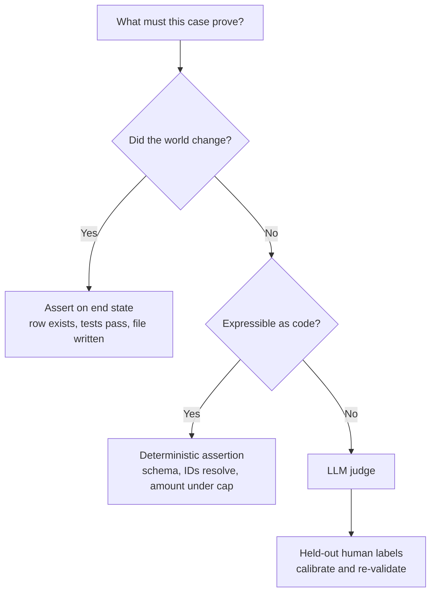

# Evaluation methods

Continuous evaluation is a first-class design goal, not an afterthought (see [framing goals](../01-framing/project-framing.md)).

Evals measure the agent's **judgement**. The deterministic layer around it — tools, schemas, the loop, guardrails — is covered by ordinary tests in build ([testing agent code](../03-build/testing-agent-code.md)); don't use evals to find a bug a unit test would have caught.

This note is the canonical home for *how* to score an agent. The other notes in this section cover where the cases come from ([eval datasets](eval-datasets.md)), the judge ([LLM-as-judge](llm-as-judge.md)), sessions and memory ([multi-turn & memory](multi-turn-and-memory.md)), policy rails ([guardrail evaluation](guardrail-evaluation.md)), production ([online evaluation](online-evaluation.md)), and the release gate ([CI & triggers](eval-in-ci.md), [regression & drift](regression-and-drift.md)).

## Grade the outcome, not the path

An agent's transcript is not evidence. A booking agent that says *"your flight is confirmed"* has proven nothing; the reservation row in the database has. Wherever the agent mutates state, **assert on the state**: the record exists, the file compiles, the ticket is in the right queue, the query returns the expected rows.

Two consequences:

- **Build eval environments that can be inspected and reset**, not just prompts and expected strings. A seeded sandbox DB per case is worth more than a hundred fuzzy string matches.
- **Don't grade the trajectory shape.** Penalising an agent for taking four tool calls instead of three punishes valid strategies. Grade the *invariants* the trajectory must respect — no write before approval, no PII in an outbound call, no more than N steps — and leave the rest free.

Transcripts are for **diagnosis**: once a case fails, the trace tells you why. That is a debugging artefact, not a score ([monitoring & observability](../06-operations/monitoring-and-observability.md)).

## Three graders

| Grader | Cost | Deterministic | Use for |
| --- | --- | --- | --- |
| **Code** | ~0 | Yes | State checks, schema validity, exact/numeric answers, forbidden-string checks, tool-call assertions |
| **Model** | Medium | No — needs calibration | Open-ended quality, tone, faithfulness to a source, rubric adherence |
| **Human** | High | Gold standard | Calibrating the other two, ambiguous cases, the initial failure taxonomy |

**Use a judge only for what code cannot check.** Teams routinely reach for one on "is the JSON valid", "did it cite a real document ID", "is the total under the cap" — all one line of Python, and unlike a judge they never drift and never need re-validating.

Human graders never disappear; they move from *scoring everything* to *calibrating the graders that score everything*.

## Reliability: one run tells you nothing

Agents are stochastic and the variance is large. Two metrics:

- **pass@k** — succeeds at least once in k attempts. Relevant when a human picks from candidates, or when retrying is free.
- **pass^k** — succeeds in *all* k attempts. This is the production metric, because users hit the agent once and expect it to work.

The gap is brutal. If your dashboard says 75% and your users say it's unreliable, you are both right — you measure pass@1, they experience pass^k:

| Per-trial | pass^2 | pass^3 | pass^5 | pass^8 |
| --- | --- | --- | --- | --- |
| 95% | 90% | 86% | 77% | 66% |
| 90% | 81% | 73% | 59% | 43% |
| 75% | 56% | 42% | 24% | 10% |

Run **k trials per case** (3–5 is usually enough to see the problem), report the spread, and never gate a release on a single-trial number.

## Two kinds of eval set, two target scores

| | Capability set | Regression set |
| --- | --- | --- |
| **Purpose** | Find the ceiling, drive improvement | Prove nothing broke |
| **Cases** | Hard, currently failing or marginal | Known-good behaviour, past bugs, policy rails |
| **Healthy score** | Low — 30–60%. A set you pass is a set that has stopped informing you | Near 100%. Any drop is a defect |
| **When it runs** | On model/architecture change, exploration | Every prompt, tool, or model change ([CI & triggers](eval-in-ci.md)) |

Mixing them into one number destroys both signals. Keep them as separate suites with separate gates.

**Watch for saturation.** When a capability set approaches 100% it has stopped measuring anything — retire it, or add harder cases sampled from what still fails in production.

## Deterministic where you can

For rational or deterministic chains, use deterministic evaluation: exact, reproducible checks rather than LLM-judged ones. This is not just cost — a deterministic check is the only kind whose result means the same thing next quarter.

## Expert debate

Having several agents argue a point reduces errors, surfaces disagreement, and can break a stuck decision. This is the canonical home for the technique; [error handling](../02-design/error-handling.md) reuses it to break tie/loop situations, and [LLM-as-judge](llm-as-judge.md) reuses it as an ensemble/consensus grader.

## Start small, start from failures

20–50 tasks drawn from **real failures** is a good first suite. Early on the effect sizes are large, so small samples are informative; the suite grows as production teaches you what breaks. A small suite running today beats a comprehensive suite running never — and a suite you wrote from imagination measures your imagination.

## References

- [Anthropic — Demystifying evals for AI agents](https://www.anthropic.com/engineering/demystifying-evals-for-ai-agents) — outcome vs. transcript grading, the three grader types, pass@k vs. pass^k, capability vs. regression sets, eval saturation.
- [Sierra — τ-bench: benchmarking AI agents for the real world](https://sierra.ai/blog/benchmarking-ai-agents) — database-state grading and the pass^k reliability collapse.
- [Hamel Husain & Shreya Shankar — LLM Evals: everything you need to know](https://hamel.dev/blog/posts/evals-faq/) — error analysis before infrastructure.
- [UK AISI — Inspect](https://inspect.aisi.org.uk/) — open-source eval framework structured as datasets / solvers / scorers, with sandboxed agent tasks.
