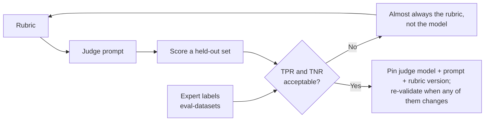

# LLM-as-judge

A judge is a classifier you did not train, did not validate, and cannot see inside. Treat it like any other model in the system: it has an error rate, it drifts, and it needs its own eval.

## Use it last, not first

Work down the [grader ladder](evaluation-methods.md#three-graders) first — state check, then deterministic assertion — and reach for a judge only for what is genuinely a matter of quality: faithfulness to a source, tone, rubric adherence, "did it answer the question asked". Most "we need a judge" requests are deterministic-assertion problems in disguise.

## Design rules

- **One judge, one dimension.** A single prompt scoring helpfulness, safety, tone, and accuracy produces one blended number that moves for unknowable reasons. Run separate judges and report separately.
- **Binary or low-cardinality labels.** "Is this answer faithful to the source: yes/no" is reproducible. "Rate 1–10" is not — the model's 7 is not stable across prompts, versions, or days. If you need severity, use 3 named levels with explicit definitions.
- **Give it an escape hatch.** Allow `unknown` / `insufficient information`. Without one, a judge that cannot tell invents a verdict, and those inventions look exactly like data.
- **Reason, then label.** Have the judge state its evidence before the verdict, and log the reason — that text is what lets a human audit the judge later.
- **Give it the reference.** Judging with a gold answer or the source document present is a far easier and more reliable task than judging in the abstract.
- **Pin it.** The judge model ID, its prompt, and the rubric version are part of the metric's definition. Changing any of them changes the metric — record all three with every score.

## Validate it as a classifier

The question is never "does the judge seem sensible", it is **"how often is it wrong, and in which direction"**.

Measure **TPR and TNR separately** — accuracy alone hides the asymmetry, and the asymmetry is what matters: a faithfulness judge that never catches a hallucination still scores 90% on a mostly-clean set. And **correct for judge error when reporting**: if the judge flags 8% and its TPR/TNR are known, the true rate is recoverable; the raw 8% is not the answer.

## Known biases and the cheap mitigations

| Bias | What it does | Mitigation |
| --- | --- | --- |
| **Position** | Prefers the first (or second) option in a pairwise comparison | Run both orders and average, or discard cases where the verdict flips |
| **Verbosity** | Scores longer answers higher | Rubric explicitly rewards completeness, not length; check score-vs-length correlation |
| **Self-preference** | Prefers text from its own model family | Use a different family as judge where possible; at minimum, don't compare models with one of them as judge |
| **Scale compression** | Everything lands on 7–8/10 | Binary or 3-level labels |

Strong judges reach roughly human-level agreement with human preferences in aggregate (>80% on MT-Bench) — but "in aggregate" is doing heavy lifting. On *your* narrow, domain-specific criterion, that number is unknown until you measure it.

## Consensus and debate

For high-stakes or genuinely contested criteria, an ensemble helps: several judges vote, or two argue the case and a third adjudicates ([expert debate](evaluation-methods.md#expert-debate)). This raises cost linearly, so reserve it for the dimensions where a wrong score changes a release decision — and note that disagreement between judges is itself a useful signal to route the case to a human.

## Offline vs. in-product judges

A judge in the offline suite and a judge in the request path are different systems with different constraints. See [online evaluation](online-evaluation.md) — the short version is that a judge measuring quality belongs on the trace stream, asynchronously, and only a judge that must *block* something belongs in the product code.

## References

- [Zheng et al. — Judging LLM-as-a-Judge with MT-Bench and Chatbot Arena](https://arxiv.org/abs/2306.05685) — >80% judge/human agreement, and the position, verbosity, and self-enhancement biases.
- [Anthropic — Demystifying evals for AI agents](https://www.anthropic.com/engineering/demystifying-evals-for-ai-agents) — isolated per-dimension judges, giving the model a way out, calibrating against human experts.
- [Hamel Husain & Shreya Shankar — LLM Evals: everything you need to know](https://hamel.dev/blog/posts/evals-faq/) — validating judges by TPR/TNR on a held-out labeled set.
