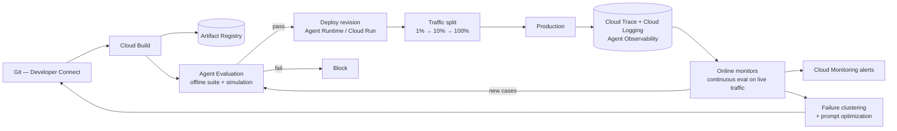

# Evaluation, observability & release on GCP

The methods are in [section 4](../04-evaluation/); the release logic is [regression & drift](../04-evaluation/regression-and-drift.md) and [rollout & safety](rollout-and-safety.md). This note is the GCP wiring: which service runs which loop, and where the deploy gate sits.

## The pipeline

## Which service runs which loop

| Playbook concept | GCP service | Notes |
| --- | --- | --- |
| [Offline eval suite](../04-evaluation/evaluation-methods.md) | **Agent Evaluation** — offline/batch runs | Final-response *and* trajectory metrics; the CI gate |
| [Simulation / adversarial suites](../04-evaluation/eval-datasets.md) | **Agent Simulation** | Synthetic users driving multi-turn conversations |
| [Online evaluation](../04-evaluation/online-evaluation.md) | **Online monitors** | Sampled continuous scoring of live traffic |
| [Guardrails in the request path](../04-evaluation/guardrail-evaluation.md) | **Model Armor**, via Agent Gateway or called directly | In-path, so it needs a latency budget and a fail-open/closed decision |
| [Trace as the unit of observation](../06-operations/monitoring-and-observability.md) | **Cloud Trace** + **Cloud Logging**, **Agent Observability** | ADK emits OpenTelemetry GenAI-convention spans over OTLP — portable to any OTel backend |
| [Free production signals](../04-evaluation/online-evaluation.md) | **Feedback Service** | User feedback joined to trace events |
| [Alerting](../06-operations/alerting-and-anomaly-detection.md) | **Cloud Monitoring** | Alert on change against a rolling baseline, not a fixed threshold |
| Failure triage → fix | **Evaluation results analysis** + **prompt optimization** | Clusters failures and proposes instruction rewrites — a suggestion, still gated by the suite |

**The gate is yours, not the platform's.** Agent Evaluation produces scores; a deploy that only *reports* them is not gated. Make the Cloud Build step exit non-zero on a threshold breach ([evals in CI](../04-evaluation/eval-in-ci.md)).

## Release mechanics

- **Immutable revisions + percentage traffic split** on both Cloud Run and Agent Runtime (preview on the latter). This is the shadow → canary → full ladder; rollback is a traffic shift, measured in seconds, not a rebuild.
- **Version-stamp every trace** — revision id, prompt hash, model version, tool-definition hash. Without it a canary comparison is a guess ([regression & drift](../04-evaluation/regression-and-drift.md)).
- **Compare canary against baseline on the same segment**, not against yesterday's global average — traffic mix moves.
- **Pin the model version.** `gemini-3.1-pro` style aliases move under you; an alias bump is a model change that skipped your eval gate.
- **Terraform the resources, not the prompt.** Infra in IaC; prompts and datasets versioned in Git and deployed with the revision, so one artefact carries both.

## Governance, if the org needs it

The **Govern** pillar is bought, not assembled: **Agent Identity** (cryptographic identity per agent), **Agent Registry** (approved tools, agents, MCP servers), **Agent Gateway** (single policy-enforcing chokepoint with Model Armor), plus topology views of which agent talks to what. Underneath it all sits ordinary GCP: per-agent service accounts, Secret Manager, VPC-SC, org policies.

Two caveats before adopting it wholesale:

- **Gateway and revisions are currently exclusive** — attaching an Agent Gateway disables traffic splitting and per-revision querying ([runtimes](gcp-runtimes.md)). Choose governance or canarying per agent until that lands.
- **A gateway is not a guardrail.** It enforces policy on traffic; it does not know whether the answer was right. Keep the [output guardrails](../04-evaluation/guardrail-evaluation.md) and the [human gate](../02-design/human-in-the-loop.md).

## References

- [Optimize your agents](https://docs.cloud.google.com/gemini-enterprise-agent-platform/optimize) — offline evals, simulation, online monitors, failure clustering, prompt optimization.
- [Observability overview](https://docs.cloud.google.com/gemini-enterprise-agent-platform/optimize/observability/overview) — traces and agent relationships.
- [Set up tracing for Agent Runtime](https://docs.cloud.google.com/gemini-enterprise-agent-platform/scale/runtime/tracing)
- [ADK — traces](https://adk.dev/observability/traces/) — OpenTelemetry GenAI semantic conventions, span tree, OTLP export.
- [Agent observability in Google Cloud Observability](https://docs.cloud.google.com/stackdriver/docs/observability/agent-observability)
- [Govern your agents](https://docs.cloud.google.com/gemini-enterprise-agent-platform/govern) — Agent Identity, Registry, Gateway, Model Armor, policies.
- [Manage revisions and traffic](https://docs.cloud.google.com/gemini-enterprise-agent-platform/scale/runtime/manage-revisions-and-traffic)
