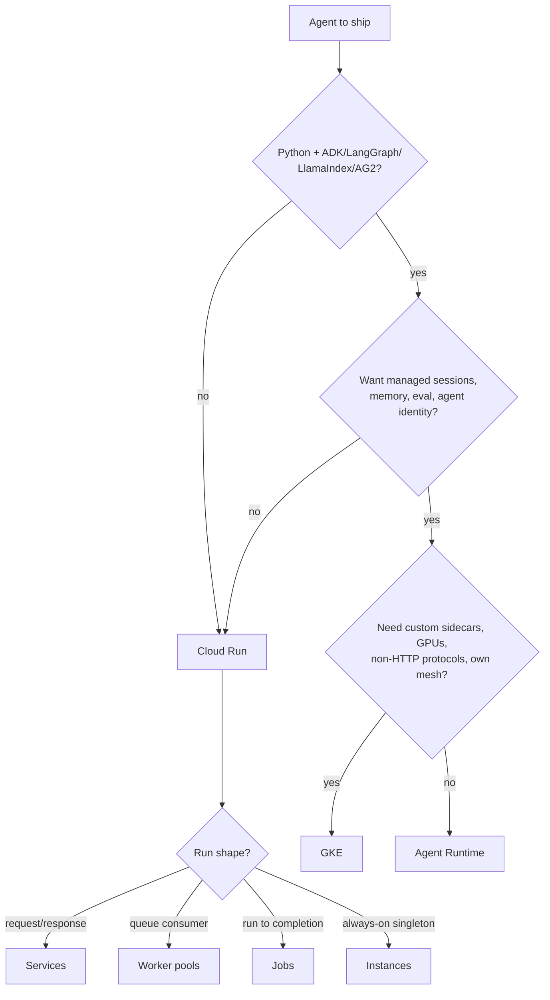

# Deploying on GCP: where the loop runs

**Naming, first.** Vertex AI was folded into the **Gemini Enterprise Agent Platform** in April 2026, and **Agent Engine** is now **Agent Runtime**. Nearly all tutorials, SDK snippets and blog posts still say "Vertex AI Agent Engine"; the concepts map 1:1, the product names and doc paths do not.

## Three runtimes, one question: what do you want to own?

| | **Agent Runtime** | **Cloud Run** | **GKE** |
| --- | --- | --- | --- |
| **You provide** | An agent object, source dir, Dockerfile, image, or a Git repo via Developer Connect | A container | A container + manifests |
| **You own** | The agent code | Container, HTTP server, scaling config | All of it, plus the cluster |
| **Language** | Python (`adk`), Go (`adkgo`); Java/TS via custom container | Anything | Anything |
| **Comes free** | Sessions, Memory Bank, tracing, agent identity, A2A, revisions + traffic split | Revisions, traffic split, IAM, scale-to-zero | Nothing agent-specific |
| **Escape hatch** | Custom container template | Portable image | Portable everything |
| **Picks itself when** | Python agent, GCP-committed, want the managed state plane | Another language, another framework, or the agent is one endpoint in an existing service | Open-weights model on your own GPUs, or platform team already runs GKE |

Default to **Cloud Run** unless you actually want the managed state plane; default to **Agent Runtime** if you do and you're on Python. GKE is a platform decision made before this agent existed — don't let one agent justify a cluster.

## The timeout wall decides your execution shape

- **Cloud Run services**: request timeout defaults to **5 min**, max **60 min**. Anything longer, or anything with a human gate, must be submit-and-poll — a `202` plus a run id, with the work in a **worker pool** (Pub/Sub consumer) or a **Cloud Run job**.
- **Agent Runtime**: long-running operations up to **7 days**, sub-second cold starts.

This is the same fork as [state & execution](../03-build/state-and-execution.md) — the GCP-specific part is only which resource carries the background half. Picking a runtime before deciding the execution shape is how teams end up rewriting the transport ([frameworks & infra](../03-build/frameworks-and-infra.md)).

## Revisions and traffic

Both managed runtimes give you immutable revisions and percentage traffic splits, which is the mechanism behind the [staged-rollout ladder](rollout-and-safety.md) and the only sane rollback: shift traffic, don't redeploy.

- **Cloud Run** — revisions, `--tag` URLs for testing a revision without serving it traffic, gradual `--to-revisions` splits. Mature.
- **Agent Runtime** — revisions and traffic splitting are **public preview**, with a trap: an agent with an **Agent Gateway** attached cannot use revisions, traffic splits, or per-revision querying. Governance and canarying are currently an either/or.

## Networking and identity

- **One service account per agent**, scoped to exactly the tools it calls — the blast radius of a prompt injection is that account's IAM ([security & compliance](../02-design/security-and-compliance.md)).
- **Private Service Connect** interfaces and **VPC Service Controls** on Agent Runtime; Serverless VPC connectors / Direct VPC egress on Cloud Run. Needed the moment a tool talks to a private database.
- **Secret Manager** for tool credentials — never baked into the image, never in env vars committed to the repo.

## Cost shape

Runtime compute is rarely the bill: **model tokens dominate**, usually by an order of magnitude ([cost management](../06-operations/cost-management.md)). What the runtime choice actually controls:

- **Scale-to-zero vs. min instances** — a min-instance floor buys latency and costs 24/7. Only defensible once traffic is continuous.
- **Idle-during-tool-calls** — an agent waiting on a slow API burns instance time on any runtime. Concurrency per instance is the lever.
- **Batch work belongs in jobs**, off the request path, where there is no latency budget to defend.

## References

- [Agent Platform overview](https://docs.cloud.google.com/gemini-enterprise-agent-platform/overview) — the build / scale / govern / optimize split and what each pillar contains.
- [Agent Runtime](https://docs.cloud.google.com/gemini-enterprise-agent-platform/build/runtime) — framework support, streaming, PSC, VPC-SC.
- [Deploy an agent](https://docs.cloud.google.com/gemini-enterprise-agent-platform/scale/runtime/deploy-an-agent) — the five deployment inputs.
- [Manage revisions and traffic](https://docs.cloud.google.com/gemini-enterprise-agent-platform/scale/runtime/manage-revisions-and-traffic) — immutable revisions, percentage splits, and the Agent Gateway restriction.
- [Host AI agents on Cloud Run](https://docs.cloud.google.com/run/docs/ai-agents) — services vs. instances vs. worker pools vs. jobs, MCP hosting, sandboxed code execution, GPUs.
- [Cloud Run request timeout](https://docs.cloud.google.com/run/docs/configuring/request-timeout) — 5 min default, 60 min max.
- [ADK — deploying your agent](https://adk.dev/deploy/) — Agent Runtime, Cloud Run, GKE, and self-hosted containers.
- [Single-agent AI system using ADK and Cloud Run](https://docs.cloud.google.com/architecture/single-agent-ai-system-adk-cloud-run) — reference architecture.
