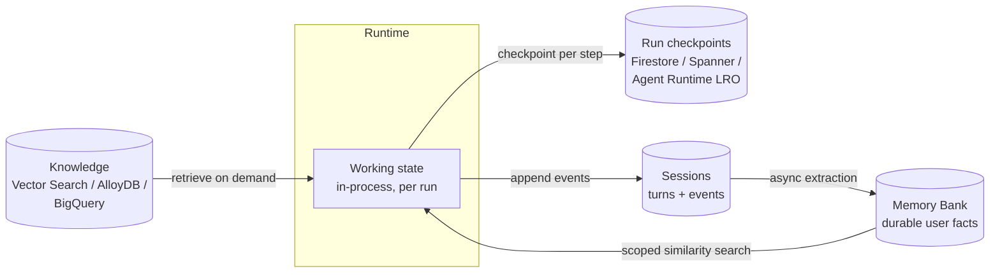

# Sessions & memory on GCP

The design decisions live in [memory & context engineering](../02-design/memory.md) and [state & execution](../03-build/state-and-execution.md). This note is only the mapping: which GCP service carries each horizon, and what breaks if you pick wrong.

## The four stores behind one agent

| Horizon | Lives for | Managed GCP | Roll your own |
| --- | --- | --- | --- |
| **Working state** | One run | In the Agent Runtime instance | In your process |
| **Run checkpoints** | Until the run ends (or a human answers) | Agent Runtime long-running operations (≤ 7 days) | Firestore, Cloud SQL/AlloyDB, Spanner; Workflows for the orchestration |
| **Session** | One conversation | **Agent Sessions** — chronological events + state | Firestore, Memorystore (hot) + Postgres (durable) |
| **Long-term memory** | Across conversations | **Memory Bank** — extracted, consolidated facts | Postgres/Firestore for the profile + a vector store for recall |
| **Knowledge** | Independent of any user | Vector Search, AlloyDB (ScaNN/HNSW + RRF hybrid), BigQuery, Firestore vector | [Anything](../03-build/vector-databases.md) |

Two rows people collapse and shouldn't:

- **Sessions ≠ checkpoints.** Sessions store *what was said*; a checkpoint stores *where the loop was*. A human-in-the-loop gate resumes from a checkpoint, not from a transcript ([state & execution](../03-build/state-and-execution.md)). Appending an event is not the same as being able to restart step 4 in a fresh process.
- **Memory ≠ history.** Memory Bank distils sessions into facts; keeping all history is not memory, it's a token bill ([context rot](../02-design/memory.md)).

## Memory Bank, concretely

- **Generation is asynchronous** — call `GenerateMemories` at end of turn/session, or stream events and let batching rules trigger it. The user never waits on extraction.
- **Scope is the isolation boundary** — `{agent_name, user}`. Getting the scope key wrong is a cross-tenant data leak, not a quality bug. Treat it as a security control ([security & compliance](../02-design/security-and-compliance.md)).
- **Consolidation** merges new information into existing memories instead of appending contradictions — which is exactly the knowledge-update behaviour you must test for ([multi-turn & memory evaluation](../04-evaluation/multi-turn-and-memory.md)).
- **TTL** expires stale facts. Set one. A profile that never forgets is a profile that is confidently wrong about a job the user left two years ago.
- **Retrieval** is either all-memories-for-scope or scoped similarity search. The second is what you want once a user has hundreds of facts.

## What deploying these actually costs you

- **Regionality.** Sessions and Memory Bank are regional resources holding user content. Pin the region for [data residency](../02-design/security-and-compliance.md) before the first write, not after.
- **Deletion path.** A GDPR erasure request must reach sessions, memories, checkpoints, traces, *and* logs. Design one delete-by-user routine per store now; retrofitting it across five stores is the expensive version.
- **Billing shape.** Agent compute (vCPU/GiB-hour) plus storage per GiB-month, plus read/write operations — and the extraction and embedding **model tokens are billed separately**. A chatty memory-generation cadence shows up as a model bill, not a storage bill ([cost management](../06-operations/cost-management.md)).
- **Lock-in.** Sessions and Memory Bank are the stickiest part of the platform: the runtime is a container you can move, the accumulated memories are not. Keep an export path, and keep the memory read/write behind your own interface so the store is swappable.

## References

- [Agent Platform Memory Bank](https://docs.cloud.google.com/gemini-enterprise-agent-platform/scale/memory-bank) — async generation, scopes, consolidation, TTL, similarity retrieval.
- [Agent Platform Sessions](https://docs.cloud.google.com/gemini-enterprise-agent-platform/scale/sessions) — sessions, events, and state vs. memory.
- [Scale your agents](https://docs.cloud.google.com/gemini-enterprise-agent-platform/scale) — Runtime, Sessions, Memory Bank, Feedback Service, sandboxed code execution.
- [AlloyDB AI vector search](https://docs.cloud.google.com/alloydb/docs/ai/vector-search-overview) — ScaNN and HNSW indexes, auto embeddings, hybrid search with RRF.
- [Vector Search overview](https://docs.cloud.google.com/vertex-ai/docs/vector-search/overview) — the standalone ANN service.
- [Agent Platform pricing](https://cloud.google.com/products/gemini-enterprise-agent-platform/pricing) — agent compute, storage, and per-operation SKUs.
