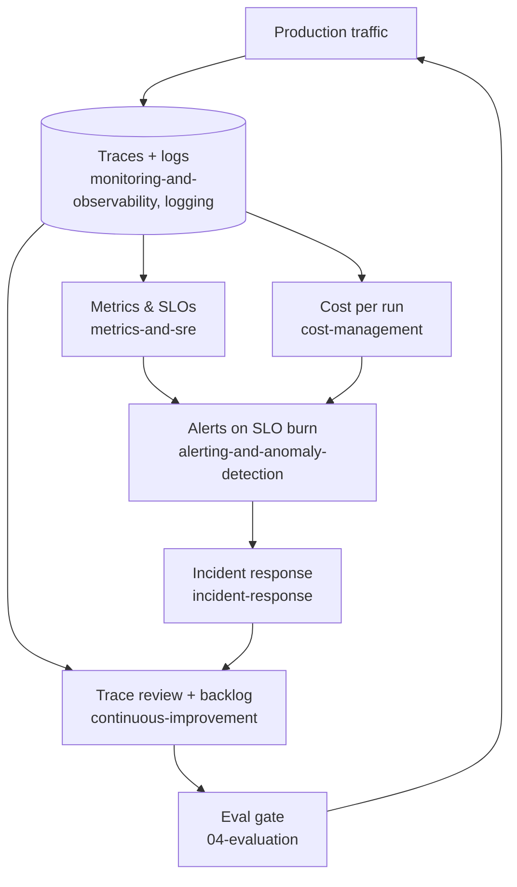

# 6. Operations

Running and improving it in production.

_Scope: monitoring & observability, key metrics & SLOs, alerting, logging, cost management, incident response, feedback loops, iteration._

## Notes

- [monitoring-and-observability.md](monitoring-and-observability.md) — the run as the unit of observation; what to capture per level; version stamping; sampling & retention tiers; OTel GenAI conventions; tooling.
- [metrics-and-sre.md](metrics-and-sre.md) — the four metric families; cost per *successful* run; TTFT vs run duration; symptom-based SLIs and SLOs; retry & fallback.
- [alerting-and-anomaly-detection.md](alerting-and-anomaly-detection.md) — dependency, tool and run-health signals; rate-limit headroom; synthetic canaries; making graceful degradation visible; burn-rate alerting.
- [logging.md](logging.md) — logs vs metrics vs traces; debug log vs audit journal; whether to store payloads; parsimony, cold storage, no PII.
- [cost-management.md](cost-management.md) — cost across the lifecycle; design-time levers and estimation; running-system token/model costs; no useless LLM calls; semantic caching.
- [incident-response.md](incident-response.md) — broken vs. bad; the agent incident taxonomy; kill switches; compensating actions for side effects; postmortem → eval case.
- [continuous-improvement.md](continuous-improvement.md) — classifying complaints; the change ladder; review cadence; model deprecation as forced iteration; when to stop.

## The short version

1. Instrument the run before you ship it — a trace cannot be added to an incident retrospectively.
2. HTTP 200 is not success; iterations per run and cost per *successful* run are the honest metrics.
3. Page on user-visible symptoms and SLO burn; ticket everything else.
4. Have the kill switches — autonomy, tool, prompt pin, model pin, spend cap — before the incident, in config, not in a deploy.
5. Every incident, override and edit becomes an offline eval case within the week. That loop is the product.
