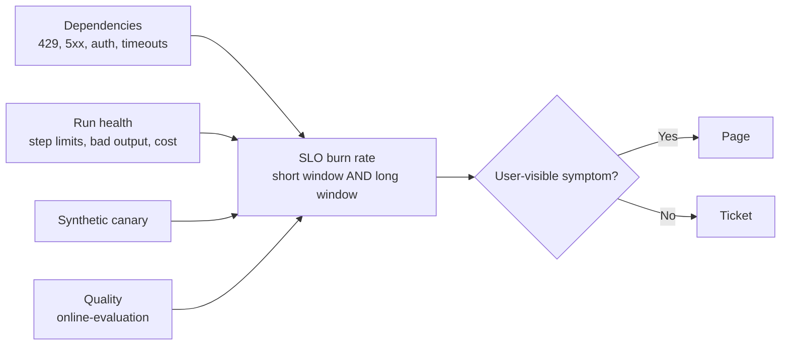

# Alerting & anomaly detection

Two different questions get asked as one. **"Is the system broken?"** — an endpoint is down, an API times out, a token expired, you're being rate-limited — is this note. **"Is the agent still good?"** — refusals rising, judge scores sliding, retrieval degrading — is [online evaluation](../04-evaluation/online-evaluation.md). Different signals, different owners, different response.

## Three layers to instrument

| Layer | Signals | Fires when |
| --- | --- | --- |
| **Dependencies** | Model provider, tool APIs, vector store, DB | A provider or integration is failing or throttling |
| **Run health** | Step limits, unparsable output, escalations, cost per run | The agent is running but degrading |
| **Quality** | Judge scores, refusal rate, override rate | Behaviour changed ([online evaluation](../04-evaluation/online-evaluation.md)) |

## Model provider

Distinguish the failure modes — they have different fixes and only one of them is retryable:

- **429 rate limit** — retry with backoff, honouring `retry-after`. Alert on the *rate* of 429s, not individual ones; a steady trickle means you are running at your ceiling and one traffic spike away from user-visible failure.
- **429 at a spend cap** — the same status code, but no `retry-after`, and retries cannot fix it. On the Claude API this carries `error.details.error_code = enforced_spend_limit_reached`. Route it to a different alert with a different runbook: someone has to raise a limit, not wait.
- **Overloaded / 5xx** — provider-side; retry, and fall back to another model or region if the design allows ([error handling](../02-design/error-handling.md)).
- **Timeouts** — often your own concurrency, not the provider.

**Alert on headroom, not on failure.** Providers return the remaining budget on every response — on the Claude API, `anthropic-ratelimit-requests-remaining`, `anthropic-ratelimit-input-tokens-remaining`, `anthropic-ratelimit-output-tokens-remaining` and the matching `-limit` / `-reset` headers. Export these as gauges and alert when remaining capacity drops below a threshold at current burn. That converts a user-facing incident into a capacity ticket a day earlier. The same headers also tell you whether caching is buying the headroom you assumed ([cost management](cost-management.md)).

## Tools & integrations

Per tool, per version: call volume, error rate by class, timeout rate, p95 latency.

The ones worth alerting on specifically:

- **401/403** — an expired credential or rotated secret. Silent, total, and always discovered by a user first if you don't watch for it ([integrations & auth](../03-build/integrations-and-auth.md)).
- **Schema-validation failures on a tool response** — the upstream API changed shape. This is the failure that nightly contract tests are for ([testing agent code](../03-build/testing-agent-code.md)); in production it should page.
- **Empty retrieval results** and **index staleness** — track the age of the last successful ingest as a metric in its own right. A stale index never errors; it just quietly answers from last month.

## Alert on absence, not just on errors

A health check tells you a service responds. It does not tell you the chain — model, tools, retrieval, auth — still works end to end.

**Run a synthetic canary**: one golden task, on a schedule, through the real path with the real model and real tools, asserting on the outcome. It is the direct answer to "how do I know the endpoint is down" and it is far better than waiting for organic traffic in a low-volume internal product, where the gap between breakage and the first user complaint can be a working day. Keep it cheap, keep it deterministic, alert when it fails twice consecutively.

Also alert on **volume dropping to zero**. No errors and no traffic looks healthy on every dashboard ever built.

## Make graceful degradation visible

A well-built agent hides outages: the tool fails, the fallback fires, the agent answers anyway — slightly worse, with no error anywhere. That is correct behaviour and a monitoring trap.

Emit an explicit metric every time a fallback path is taken: degraded answers served, cache-only responses, skipped enrichment, model fallbacks. **Silent degradation must be loud in telemetry**, or you find out only when quality metrics sag weeks later with no incident to point at.

## Alert on SLOs, not thresholds

Static thresholds on agent metrics either page constantly or never. Define an SLO per user-visible symptom — successful runs, p95 latency — and use **multi-window, multi-burn-rate** alerting: a short window catches fast burns, a long window catches slow ones, and requiring both kills most of the noise. It applies as well to a *quality* SLO as to an availability one.

Route by severity, not by metric. An agent stack generates enough weak signals to bury an on-call rotation in a week.

## Instrument to a standard

Use the OpenTelemetry GenAI semantic conventions for spans, metrics, and attributes — token usage, operation duration, model, tool calls — so these alerts sit on the infrastructure the rest of the company already runs, instead of a bespoke schema that only your LLM platform understands ([monitoring & observability](monitoring-and-observability.md)).

## References

- [Google SRE Workbook — alerting on SLOs](https://sre.google/workbook/alerting-on-slos/) — multi-window, multi-burn-rate alerting and the precision/recall trade-off it solves.
- [Claude API — rate limits](https://platform.claude.com/docs/en/api/rate-limits) — the `anthropic-ratelimit-*` headers, `retry-after`, and how a spend-cap 429 differs from a rate-limit 429.
- [OpenTelemetry — GenAI semantic conventions](https://github.com/open-telemetry/semantic-conventions-genai) — standard spans, metrics, and events for GenAI clients, MCP, and agents.
