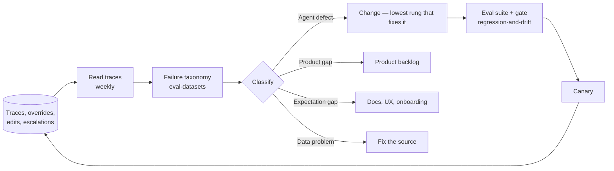

# Feedback loops & iteration

Production is where the eval set gets its best material. An agent that ships and is never re-read is an agent whose quality is a rumour — the offline suite covers what you thought of, and the traffic covers what you didn't ([online evaluation](../04-evaluation/online-evaluation.md)).

## Classify before you fix

Not every complaint is an agent defect, and the wrong classification wastes a sprint on prompt engineering.

| Class | Looks like | Owner |
| --- | --- | --- |
| **Agent defect** | It had what it needed and got it wrong | Engineering — see the ladder below |
| **Product gap** | It was asked to do something out of scope | Product ([scoping](../01-framing/scoping-the-first-version.md)) |
| **Expectation gap** | Correct output, unhappy user | UX, docs, onboarding ([adoption](../05-deployment/adoption-and-change-management.md)) |
| **Data problem** | The source of truth was wrong or stale | Data owner — no prompt fixes this |

## The change ladder

Start at the top. Most quality complaints are solved lower down than the team assumes, and the failure taxonomy — not intuition — says which rung.

| Rung | Effort | Risk | Gate before shipping |
| --- | --- | --- | --- |
| Prompt wording | Hours | Silent regressions elsewhere | Full suite + canary |
| Tool description / schema | Hours | Changes routing globally | Tool-level evals + full suite |
| Retrieval config — chunking, `top_k`, reranking, index | Days | Shifts every grounded answer | Retrieval evals + full suite |
| Model swap | Days | Behaviour changes everywhere | Paired non-inferiority + canary ([regression & drift](../04-evaluation/regression-and-drift.md)) |
| Architecture — split an agent, add a deterministic step | Weeks | High | Re-design ([architecture](../02-design/architecture.md)) |

**Never tune a prompt for a retrieval problem.** It sometimes works, and it hides the real defect behind wording that the next model upgrade will erase.

## Cadence

| Rhythm | Activity |
| --- | --- |
| **Daily** | Alert queue; anything that paged |
| **Weekly** | Read a sample of traces plus *all* escalations and overrides; update the failure taxonomy; file new eval cases |
| **Monthly** | Re-baseline cost per successful run; review SLO error budget; prune stale eval cases; check whether the [value metrics](../01-framing/measuring-value.md) actually moved |
| **Quarterly** | Model landscape review; re-price the system; re-test the assumptions in the design doc |

Reading traces is not optional and does not delegate well. It is the only activity that reliably produces categories nobody had thought of.

## Model lifecycle is forced iteration

Providers retire models, so "we'll upgrade when we have time" is not a strategy — the deadline is theirs. On the Claude API models move through **Active → Legacy → Deprecated → Retired**, deprecated models get a published retirement date with at least 60 days' notice, and requests after that date **fail**.

Practices that make a forced migration boring:

- **Pin an explicit model id in runtime config**, never in code. Pinning makes behaviour reproducible; keeping it in config makes the swap and the rollback a flag flip ([incident response](incident-response.md)).
- **Audit what is actually running** — the Claude Console usage export breaks usage down by API key and model, which is how the forgotten nightly job on a retired model gets found before it starts failing.
- **Budget the re-baseline, not just the swap.** A new model changes quality, cost, latency *and* step counts: re-run the suite, re-measure cost per successful run, re-tune stop conditions and any prompt that was fitted to the old model's quirks.
- Treat the migration as a normal release: paired comparison, canary, rollback pinned and ready.

A model upgrade is also the best moment to delete accumulated prompt scar tissue — instructions added to patch behaviours the new model no longer exhibits.

## Knowing when to stop

Iteration has diminishing returns, and "keep improving the agent" is a default that outlives its justification. Re-check against framing: is the remaining gap worth the engineering, is the freed time still being realised, is the unit cost still under the human baseline ([measuring value](../01-framing/measuring-value.md))? Freezing a good-enough agent — or retiring one whose use case evaporated — is a legitimate outcome, and cheaper than maintaining a system nobody has re-justified in a year.

## References

- [Claude API — model deprecations](https://platform.claude.com/docs/en/about-claude/model-deprecations) — the Active/Legacy/Deprecated/Retired lifecycle, the ≥60-day notice, and auditing usage by key and model.
- [Anthropic — Demystifying evals for AI agents](https://www.anthropic.com/engineering/demystifying-evals-for-ai-agents) — production monitoring and ongoing transcript review as part of the eval loop.
