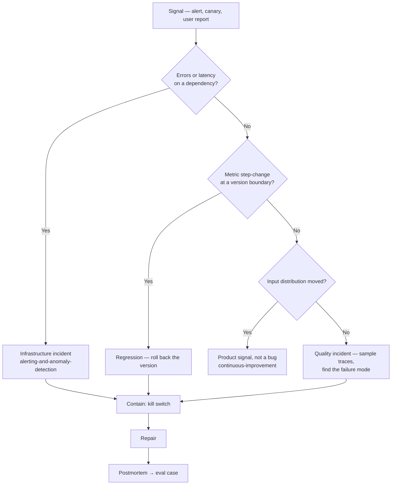

# Incident response

An agent incident rarely looks like an outage. Nothing 500s. The agent simply starts being wrong, or expensive, or slow — and the first report comes from a user, not a monitor. Response therefore has an extra first question that classical SRE does not: **is it broken, or is it bad?**

## Taxonomy

| Incident | First signal | Contain | Real fix |
| --- | --- | --- | --- |
| **Provider throttled or down** | 429/529 rate, headroom gauges | Fail over model or region, shed load, degrade | Capacity headroom + tested fallback ([error handling](../02-design/error-handling.md)) |
| **Spend cap hit** | 429/400 with no `retry-after` | Raise the limit — retries cannot fix it | Burn-rate alert before the cap ([cost management](cost-management.md)) |
| **Credential expired or rotated** | 401/403 on one tool, silent and total | Rotate; disable the tool if it fails open | Expiry monitoring ([integrations & auth](../03-build/integrations-and-auth.md)) |
| **Tool contract changed** | Schema-validation failures on tool responses | Pin or disable the tool | Nightly contract tests ([testing agent code](../03-build/testing-agent-code.md)) |
| **Bad prompt/model deploy** | Step-change in quality or iterations at a version boundary | Roll back the version | Eval-gate coverage for that failure ([release gate](../04-evaluation/regression-and-drift.md)) |
| **Runaway loops / cost spike** | p95 iterations and p95 cost per run | Lower `max_steps`, cap spend | Stop conditions ([rollout & safety](../05-deployment/rollout-and-safety.md)) |
| **Stale or broken index** | Empty-retrieval rate, ingest age | Serve degraded, re-ingest | Freshness alert as a first-class metric |
| **Prompt injection / exfiltration** | Guardrail trip, anomalous tool arguments | Revoke tokens, disable the tool, isolate the tenant | Least-privilege scoping ([security & compliance](../02-design/security-and-compliance.md)) |
| **Wrong side effects at scale** | Downstream complaints, override rate | Kill switch, then compensating actions | HITL gate on that action ([human-in-the-loop](../02-design/human-in-the-loop.md)) |

## Have the kill switches before you need them

All flag-flipped, none requiring a deploy, ordered by blast radius. This is the [rollout ladder](../05-deployment/rollout-and-safety.md) run in reverse:

1. **Downgrade autonomy one rung** — acting → proposing, with a human approving. Keeps the product alive while removing the risk.
2. **Disable one tool**, or force the agent read-only.
3. **Pin the previous prompt version.**
4. **Pin the previous model version.**
5. **Cap spend or rate per tenant** — contains a cost incident without stopping everyone.
6. **Full stop** — queue or reject, with a stated fallback path for users.

> **If your only lever is a code deploy, your MTTR is your CI time.** Model id, prompt version, tool enablement and autonomy level belong in runtime config, not in the binary.

## The rollback that isn't

Config rolls back in seconds; **side effects do not**. Emails were sent, tickets closed, records written, refunds issued. Reverting the prompt stops the bleeding and repairs nothing.

This is why every write tool needs an identifiable, queryable action log — action type, target, run id, timestamp, idempotency key — so containment can be followed by a **compensating pass**: list everything the bad version did, decide per action whether to reverse it, and reverse it under human approval ([state & execution](../03-build/state-and-execution.md)). Deciding this during the incident is how a two-hour incident becomes a two-day one.

## Roles

Standard incident command applies — a commander who does not type, an ops lead who does, a comms role — with one addition: an agent incident needs a **domain reviewer** who can authoritatively say whether an output is actually wrong. Engineers routinely cannot, and hours get lost arguing about whether there is an incident at all.

Attach the provider `request-id` to every model-call span; a provider-side escalation is then one query, not a reconstruction ([monitoring & observability](monitoring-and-observability.md)).

## Postmortem → eval case

Blameless, and the deliverable is **not the document**. Every incident ends as:

1. a **case in the regression set**, so this exact failure is now gated forever ([eval datasets](../04-evaluation/eval-datasets.md));
2. an **alert that would have caught it earlier** — or an explicit decision that it isn't worth one;
3. a **kill switch** if containment required a deploy.

Past incidents are the highest-value eval cases you will ever get; they are real, they are specific, and someone already paid for them.

## References

- [Google SRE Book — managing incidents](https://sre.google/sre-book/managing-incidents/) — incident command roles and why separating them shortens incidents.
- [Google SRE Book — postmortem culture](https://sre.google/sre-book/postmortem-culture/) — blameless postmortems as a learning mechanism.
- [Claude API — errors](https://platform.claude.com/docs/en/api/errors) — status-code taxonomy (401, 403, 429, 500, 529) and request IDs for provider escalation.
