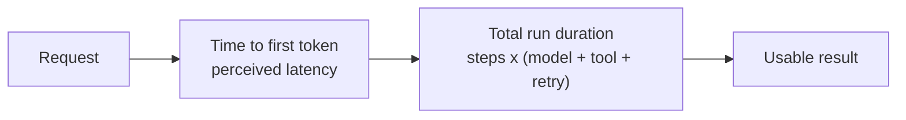

# Key metrics & SRE follow-up

**HTTP 200 is not success.** An agent fails while returning a well-formed response: it answered the wrong question, gave up and escalated, took twenty-two steps to do a two-step job, or cost three euros doing it. On the Claude API a streamed response can even carry an error *after* the 200 has been sent. So the service-level metrics every backend already has are necessary and nowhere near sufficient.

## Four families

| Family | Metrics | Answers |
| --- | --- | --- |
| **Service** | availability, p50/p95/p99 latency, error rate by class, throughput, queue depth | Is it up? |
| **Agent behaviour** | iterations per run, tool calls per run, tool error rate, step-limit hits, schema-repair rate, empty-retrieval rate, fallback/degraded rate | Is it working *sanely*? |
| **Quality** | task success, judge score by dimension, override & edit rate, refusal rate, hallucination rate | Is it *right*? ([online evaluation](../04-evaluation/online-evaluation.md)) |
| **Cost** | tokens in/out, cache-read ratio, cost per run (p50 **and p95**), **cost per successful run** | Is it affordable? ([cost management](cost-management.md)) |

Two that get skipped and shouldn't:

- **Cost per *successful* run** is the real unit price. Failures, retries and abandoned sessions are paid for in full, so a system with a 70% success rate is 1.4× more expensive than its cost-per-run dashboard claims.
- **Iterations per run** is the earliest indicator of a quality regression that exists. It moves before judge scores do, it is free to compute, and a prompt change that makes the agent flail shows up here within an hour.

Coverage metrics — calls per tool, per agent, per API — belong here too: a tool that is never called is either dead weight in the context budget or a routing bug ([tool design](../02-design/tool-design.md)).

## Latency is two metrics

With streaming, **TTFT is what the user feels** and total duration is what the workflow feels; alert on both, and never on their average. Multi-step runs are minutes-scale, so also budget a per-step timeout — one hung tool call otherwise consumes the whole run budget ([error handling](../02-design/error-handling.md)).

## From metric to SLI to SLO

Define SLOs on **user-visible symptoms**, not on internal components; that is what makes an alert worth waking someone for.

| Symptom | SLI | Example SLO (28-day) |
| --- | --- | --- |
| "I got an answer" | successful runs / valid runs | 99% |
| "It arrived in time" | runs with p95 duration < 90s | 95% |
| "It was right" | sampled judge/human pass rate | ≥ 90% |
| "It didn't cost a fortune" | runs under the per-run token budget | 99% |

A **quality SLO is a legitimate SLO** and burn-rate alerting works on it exactly as on availability ([alerting](alerting-and-anomaly-detection.md)). The error budget is the useful part: it is the budget you spend shipping prompt changes. Burn it down and the [release gate](../04-evaluation/regression-and-drift.md) tightens instead of an argument happening.

**Segment before you conclude.** Per tenant, intent, language, model and prompt version — a global average is where regressions hide ([online evaluation](../04-evaluation/online-evaluation.md)).

## SRE follow-up

- Track actuals against what was **anticipated at design time**: calls per run, cost, latency, tool coverage. The gap between the [design estimate](cost-management.md) and production is itself a metric, and it is how design assumptions get corrected.
- **Retry and fallback** — on the run, on the ranker, on the model. Designed in [error handling](../02-design/error-handling.md).
- **Retries are not free and not idempotent.** A retried run may re-execute a side-effecting tool. Count retried runs separately (a retry-inflated success rate is a lie), and key every write tool with an idempotency token ([state & execution](../03-build/state-and-execution.md)).
- Every fallback path emits its own metric, or degradation stays silent ([alerting](alerting-and-anomaly-detection.md)).

Turning these metrics into alerts that fire usefully is [alerting & anomaly detection](alerting-and-anomaly-detection.md); where the underlying data comes from is [monitoring & observability](monitoring-and-observability.md); prompt changes are gated by [the release gate](../04-evaluation/regression-and-drift.md); cost detail lives in [cost management](cost-management.md).

## References

- [Google SRE Workbook — implementing SLOs](https://sre.google/workbook/implementing-slos/) — choosing SLIs from user-visible symptoms, setting targets, and spending an error budget.
- [Claude API — errors](https://platform.claude.com/docs/en/api/errors) — error classes worth separating in a metric, and mid-stream errors after a 200.
