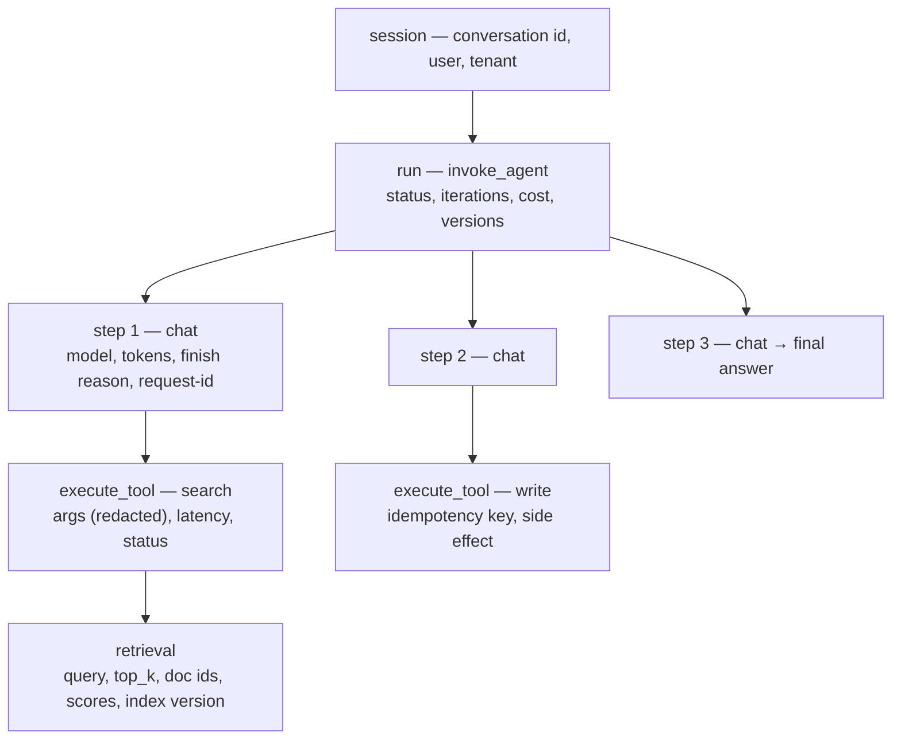

# Monitoring & observability

The unit of observation is **the run, not the request**. A classic service call is one span with a status code; an agent run is a tree — model calls, tool calls, retrievals, sub-agents, retries — and the failure is usually in the *shape* of the tree rather than in any single span. An agent that returns HTTP 200 after 22 iterations, three tool errors and a silent fallback is broken, and every request-level dashboard will show it green.

## The trace is the object

Three ids make the whole thing queryable: a **session id** spanning turns, a **run id** spanning steps, and the **provider request id** on every model call (the Claude API returns it as the `request-id` header and in error bodies — it is what a provider support ticket is opened with).

## What to capture at each level

| Level | Capture | Because |
| --- | --- | --- |
| **Session** | user/tenant, channel, number of runs, session duration, final outcome | Multi-turn quality and abandonment are invisible per-run |
| **Run** | input, final output, status, iterations, tool-call count, total tokens, cost, wall time, escalation flag, **all version stamps** | This is the row every metric and eval case is built from |
| **Step (model call)** | model, params, input/output tokens, cache-read tokens, finish reason, latency, provider request id | Attribution of cost and of truncation |
| **Tool call** | name, version, arguments (redacted), status, error class, latency, retry count, idempotency key | Tool errors are the single largest source of agent failure |
| **Retrieval** | query, `top_k`, returned doc ids, scores, index version, ingest age | "Wrong answer" is usually "nothing relevant was retrieved" |

Capture the **final output and the input verbatim** for the runs you keep — a trace you cannot replay is a dashboard, not an observability tool. What that means for payload storage, sampling and PII is [logging](logging.md).

## Version everything, or attribution is impossible

Every run carries, as first-class attributes:

`prompt_version` · `model_id` (pinned, not an alias) · `tool_definitions_hash` · `retrieval_index_version` · `code_sha` · `feature_flags` · `tenant`

A metric that moved without a version to blame is a mystery you will not solve, because with a nondeterministic system you cannot reproduce your way backwards. This is the same stamping the [release gate](../04-evaluation/regression-and-drift.md) and [online evaluation](../04-evaluation/online-evaluation.md) rely on — do it once, in the tracer.

## Sample and retain in tiers

Full payloads for 100% of traffic is the default that quietly becomes the largest bill and the largest breach surface in the system.

| Tier | Rate | Retention |
| --- | --- | --- |
| Metrics (counters, histograms) | 100% | 13 months — trends need a year-over-year |
| Trace skeleton (structure, timings, statuses, versions, **no payloads**) | 100% | 30 days |
| Full payloads (prompts, completions, tool args) | 1–10% sampled, **plus 100% of failures, escalations, guardrail trips and new versions** | Days to weeks ([logging](logging.md)) |

Stratified, not uniform — the same rule as [sampled scoring](../04-evaluation/online-evaluation.md). Uniform sampling spends the budget on the happy path.

## Instrument to a standard

Use the **OpenTelemetry GenAI semantic conventions** rather than a bespoke schema: operations are named (`invoke_agent`, `chat`, `execute_tool`, `retrieval`, `invoke_workflow`, `search_memory`) and attributes are standard (`gen_ai.operation.name`, `gen_ai.request.model`, `gen_ai.response.model`, `gen_ai.usage.input_tokens`, `gen_ai.usage.output_tokens`, `gen_ai.conversation.id`, `gen_ai.tool.definitions`). The payoff is portability: the same spans feed an LLM-native platform *and* the Datadog/Grafana/SigNoz stack the company already pays for, and swapping vendors is a config change.

## Observability tooling

These platforms treat the LLM trace as the primary object — nested spans across agents, retrievers, and tools, with evaluation scores attached to production traffic.

**AI-native trace + eval platforms**

- **LangSmith** — deep tracing, debugging, and evaluation; pairs naturally with LangChain/LangGraph. Hosted in their cloud; a bit expensive.
- **Langfuse** — the most-used open-source option; tracing, evals, prompt management, metrics; model- and framework-agnostic with self-hosting. (Earlier notes flagged it as not very stable; it has matured and now supports OpenTelemetry export.)
- **Arize Phoenix** — source-available, built on OpenTelemetry; strong on evaluation and drift detection.
- **Braintrust** — evaluation-centric platform for iterating on prompts and scoring.

**AI gateways (proxy in front of the model)**

- **Helicone**, **Portkey**, **LiteLLM** — sit between app and provider, adding logging, caching, cost tracking, and routing with minimal code changes. A gateway is also the cheapest place to put a global spend cap and a model-pin kill switch ([incident response](incident-response.md)).

**Standards** — prefer tools built on **OpenTelemetry** (Phoenix, OpenLLMetry, and OTel export from Langfuse) to avoid vendor lock-in and reuse existing infra.

Traceability requirements come from [rollout & production safety](../05-deployment/rollout-and-safety.md). What to turn into *metrics and SLOs* is [key metrics & SRE](metrics-and-sre.md); what to *alert* on is [alerting & anomaly detection](alerting-and-anomaly-detection.md); scoring production traffic for quality is [online evaluation](../04-evaluation/online-evaluation.md).

## References

- [OpenTelemetry — GenAI semantic conventions](https://github.com/open-telemetry/semantic-conventions-genai) — spans, metrics and events for GenAI clients, MCP and agents; operation names and `gen_ai.*` attributes.
- [Claude API — errors & request IDs](https://platform.claude.com/docs/en/api/errors) — the `request-id` header, error shapes, and why a streamed 200 can still contain a failure.
- [MarkTechPost — Top LLM observability & evaluation platforms in 2026](https://www.marktechpost.com/2026/08/09/top-llm-observability-and-evaluation-platforms-in-2026-langfuse-langsmith-braintrust-arize-and-more-compared/)
- [SigNoz — LLM observability tools](https://signoz.io/comparisons/llm-observability-tools/)
